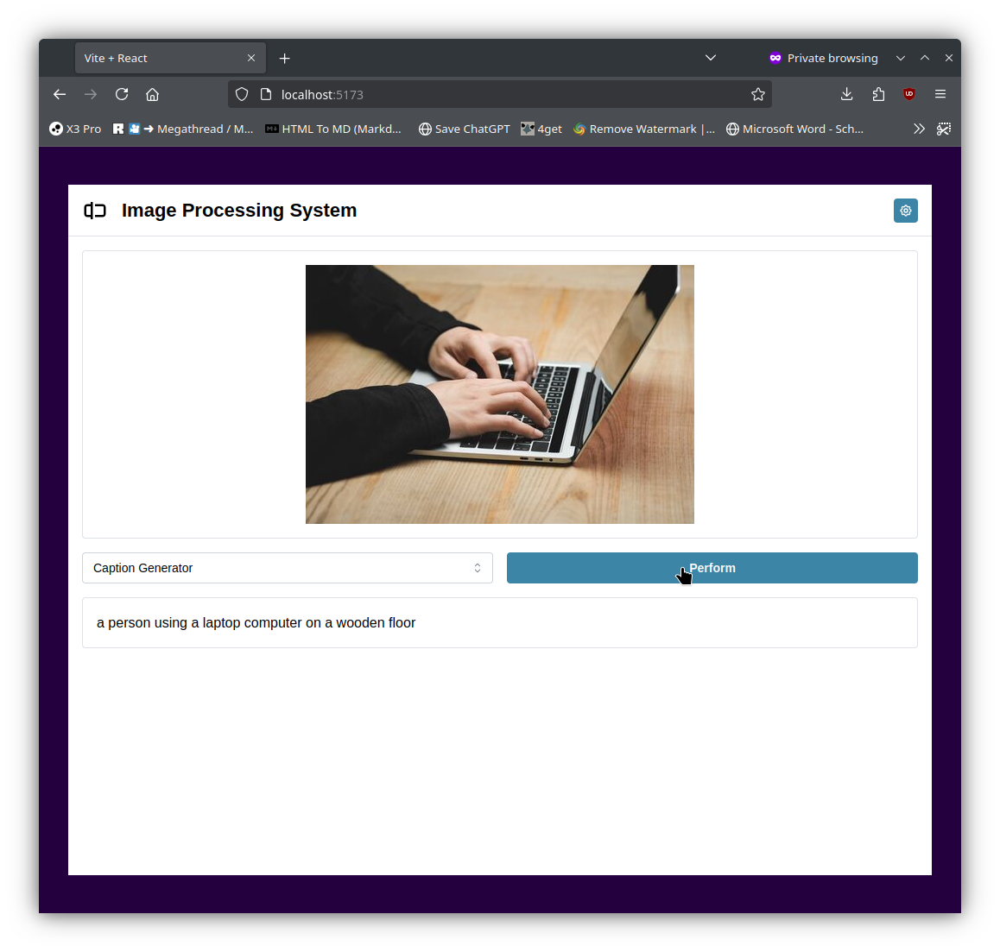
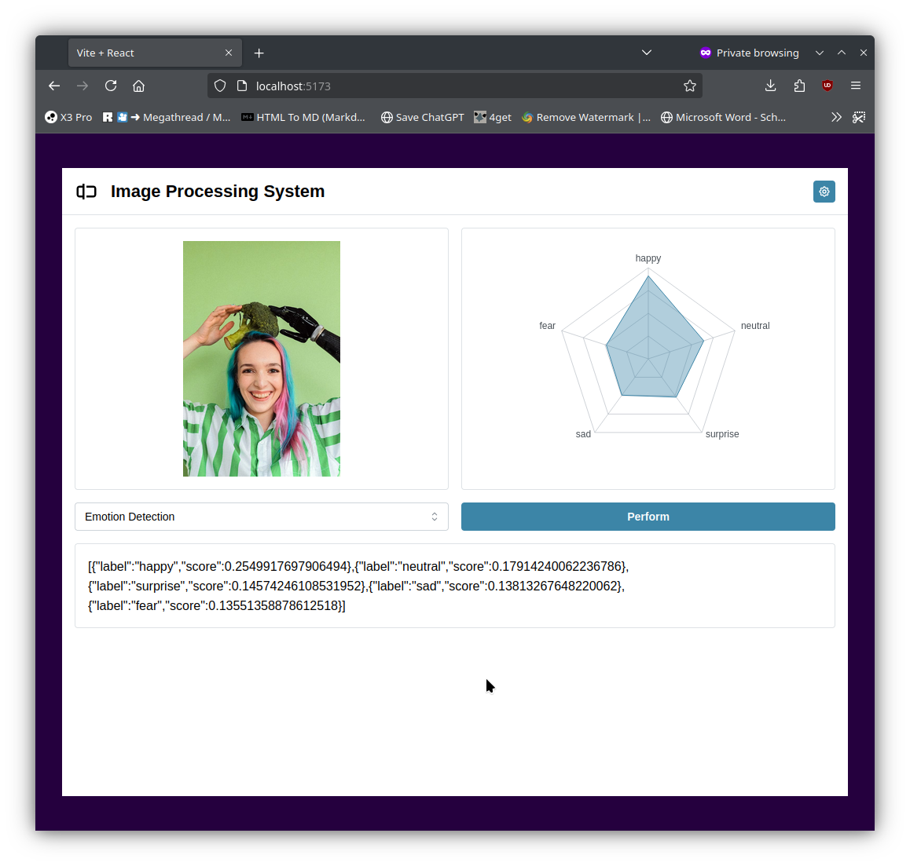
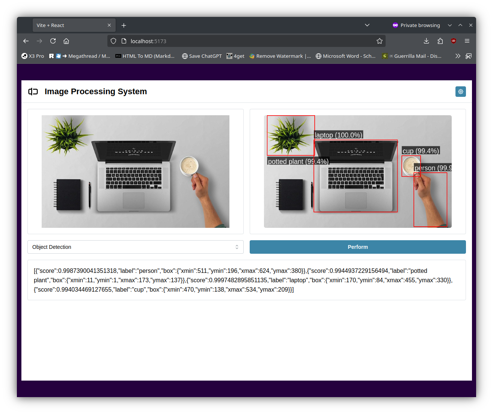
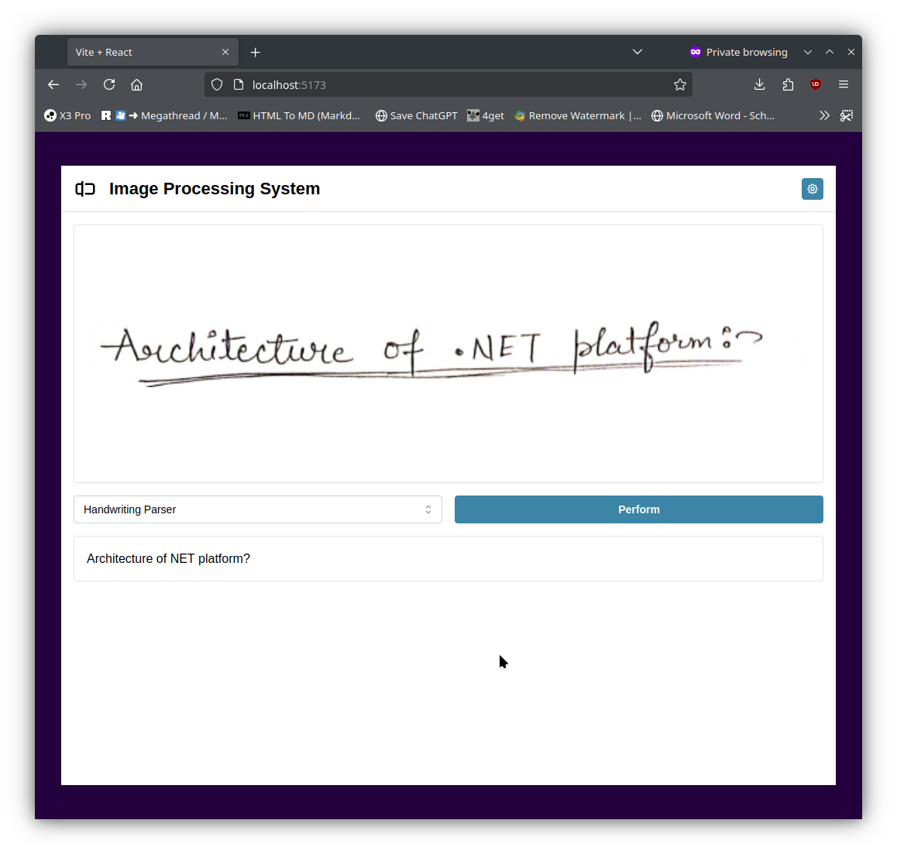
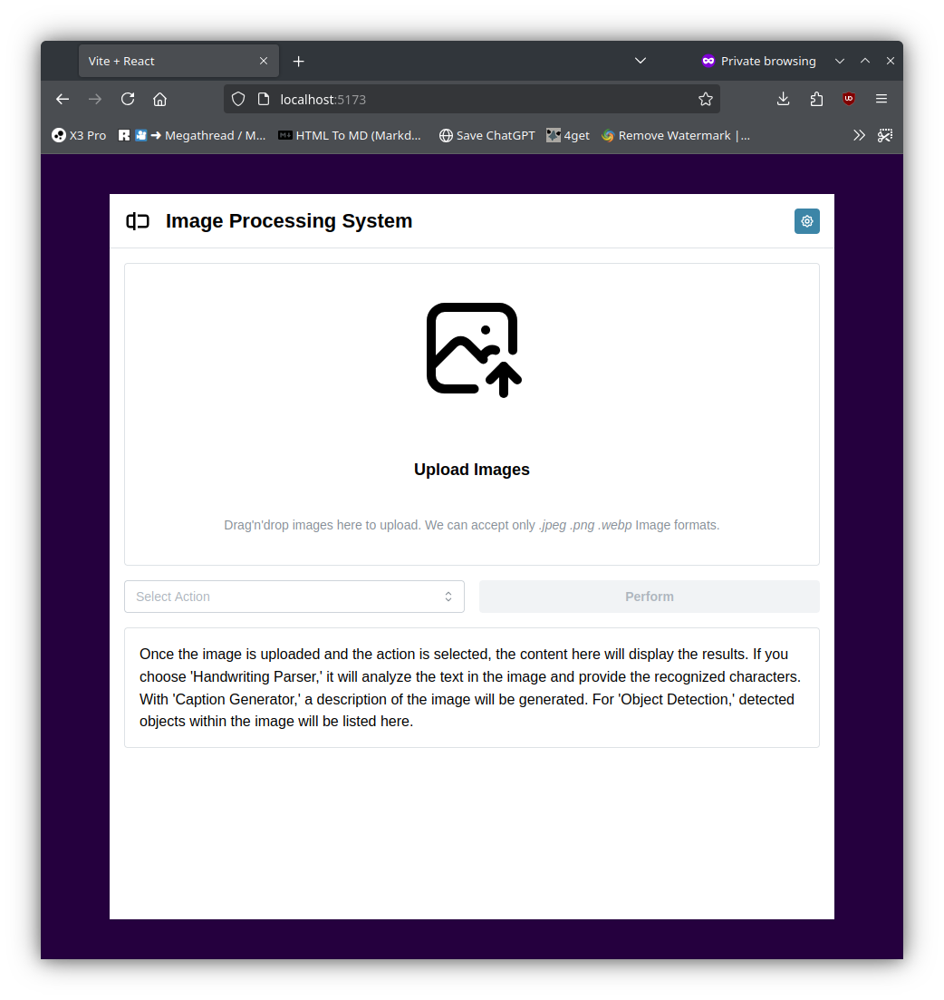

# Image Processing and Organization Tool

## Overview

This project is an advanced image processing and organization tool that utilizes machine learning models for various image-related tasks. It features a backend powered by Hugging Face's `transformers.js`, a frontend for user interaction, and a Bash script to automate image renaming based on generated captions.

## Features

- **Image Captioning**: Automatically generates captions for images.
- **Object Detection**: Identifies objects present in an image.
- **Emotion Detection**: Recognizes emotions from facial expressions.
- **OCR (Optical Character Recognition)**: Extracts text from handwritten or printed images.
- **Image Upscaling**: Enhances image resolution.
- **Automated Image Renaming**: A Bash script renames images based on their generated captions.

---

## Backend

The backend is built using `Node.js` and `Express`, utilizing the `@huggingface/transformers` library for AI-powered image processing.

### Key Components

- **Express Server**: Handles API requests.
- **Multer**: Handles file uploads.
- **Hugging Face Models**: Loads and runs various image processing models.
- **Dynamic Route Generation**: Each model has its own API endpoint.

### Available API Endpoints

| Endpoint            | Functionality                 |
| ------------------- | ----------------------------- |
| `/generate-caption` | Generates captions for images |
| `/detect-obj`       | Detects objects in an image   |
| `/detect-emo`       | Recognizes facial emotions    |
| `/generate-ocr`     | Extracts text from images     |
| `/upscale`          | Enhances image resolution     |
| `/routes`           | Lists all available endpoints |

### How to Run the Backend

1. Install dependencies:

   ```sh
   npm install
   ```

2. Start the server:

   ```sh
   node app.js
   ```

3. The server runs at `http://localhost:5100`

---

## Image Renaming Script

A Bash script automates renaming images based on AI-generated captions.

### How It Works

- Sends an image to the API.
- Retrieves the generated caption.
- Renames the image using the caption.
- Supports parallel processing for faster execution.

### Usage

```sh
./rename_images.sh -p 5 -sr _ -r responses.txt -sf image.jpg
```

#### Options

| Flag  | Description                                  |
| ----- | -------------------------------------------- |
| `-p`  | Set concurrency level (default: 3)           |
| `-sr` | Space replacement in captions                |
| `-sf` | Process a single file instead of a directory |
| `-r`  | Save API responses to a file                 |
| `-d`  | Set search depth for images in directories   |

---

## Frontend

The frontend is a `React.js` application that provides an intuitive UI for users to upload images and receive processed outputs.

### Features

- Upload images for processing.
- Select the desired processing task.
- View results with a clean UI.
- Monitor the processing status.

### Screenshot Preview

<div style="display: grid; grid-template-columns: repeat(3, 1fr); gap: 10px;">
    
    
    
    
    
    
</div>

### How to Run the Frontend

1. Navigate to the frontend directory:

   ```sh
   cd frontend
   ```

2. Install dependencies:

   ```sh
   npm install
   ```

3. Start the development server:

   ```sh
   npm start
   ```

4. Open `http://localhost:3000` in your browser.

---

## Installation

### Prerequisites

- Node.js & npm
- Bash (for script execution)

### Steps

1. Clone the repository:

   ```sh
   git clone https://github.com/Sahil-958/ims.git
   ```

2. Set up and run the backend.
3. Run the frontend.
4. Use the script to rename images if needed.

---

## Future Enhancements

- Implementing user authentication.
- Extending support for more image transformations.
- Adding a database to store processing history.

---
